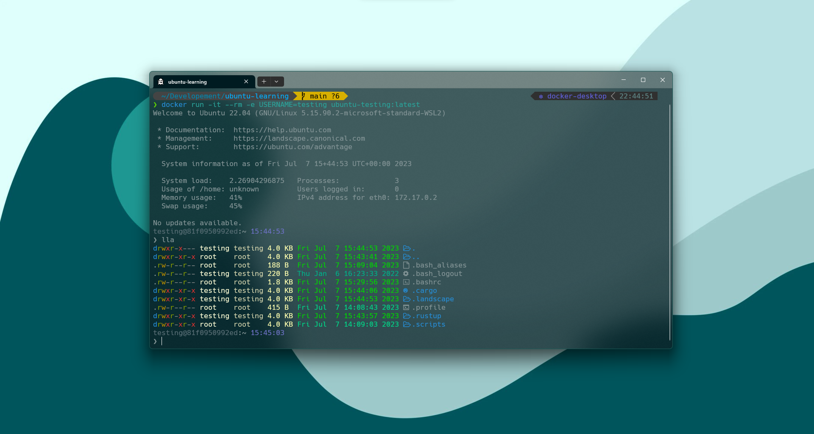

<h1 align="center"><code>🐧</code> Ubuntu on Docker</h1>

<div align="center">
    
</div>

## `📖` Description

This repository contains a Dockerfile for building an Ubuntu image with some useful tools installed.

> **Note**: This image is built on top of the [official Ubuntu image](https://hub.docker.com/_/ubuntu).

## `🙉` Purpose

This image is built for personal use, and for learning linux and docker.

## `📸` Screenshots



> **Note**: You can see alias on [`.bash_aliases`](./config/.bash_aliases) file.

## `📝` Usage

### `🔨` Pull the image

```bash
docker pull pungrumpy/ubuntu-learning
```

### `🏃` Run the container

```bash
docker run -it --rm --name ubuntu-learning -e USERNAME=<your-username> pungrumpy/ubuntu-learning
```

> **Note**: If you userr `--rm` flag, all data will be lost after exiting the container. and if you want to keep the data, should remove the `--rm` flag.

## `📦` Packages

- [x] `git`
- [x] `gcc`
- [x] `python3`
- [x] `python3-pip`
- [x] `cargo`
- [x] `lsd`

## `📜` License

[MIT](LICENSE)
